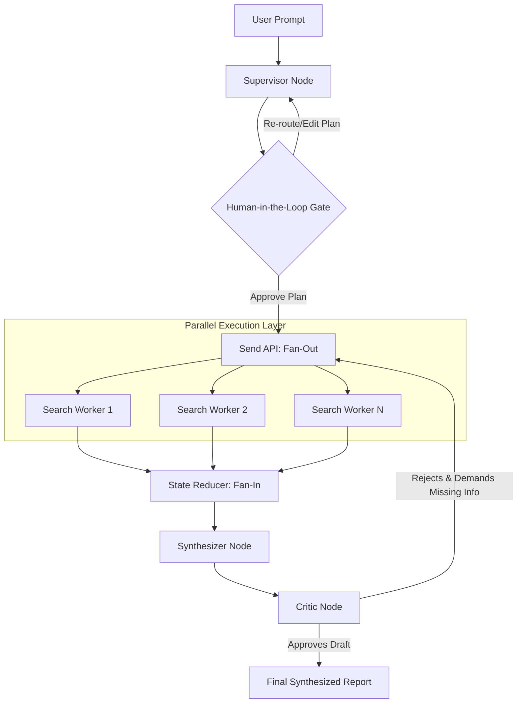

# Deep Research Meta-Agent
### Autonomous, Parallelized, and Self-Reflecting AI Research Architecture

## Abstract & Overview
The Deep Research Meta-Agent is a multi-agent AI system designed to automate web research, citation auditing, and report synthesis. 

The system is modeled as a deterministic state machine. It utilizes dynamic Map-Reduce parallelism to execute web searches concurrently, enforces Human-in-the-Loop (HITL) checkpoints, and features a reflection loop that identifies knowledge gaps and triggers targeted research.

## Key Engineering Innovations

* **Dynamic Map-Reduce Parallelism (Fan-Out/Fan-In):** Utilizes LangGraph's `Send` API to spawn independent, parallel sub-agents for each sub-topic. This prevents sequential network bottlenecking and drastically reduces total execution time.
* **Compiler-Level Data Validation:** Binds the LLM to strict `Pydantic` JSON schemas, completely eliminating string-parsing errors, formatting hallucinations, and runtime exceptions.
* **Stateful Checkpointing (SQLite WAL):** Conversational memory and graph state are persisted locally using an SQLite database configured in Write-Ahead Logging (WAL) mode, allowing high-throughput concurrent reads/writes from parallel agents.
* **Human-in-the-Loop (HITL) Execution:** Implements hard `interrupt()` circuit breakers. The graph serializes its state to disk and suspends execution indefinitely until a human operator reviews and authorizes the AI's search plan.

## System Architecture & Workflow

The architecture separates the planning (Supervisor) from the execution (Searchers) to prevent context degradation. 



### The Agentic Roster

1. **The Supervisor:** Parses the initial user prompt and decomposes the complex query into distinct, independent sub-topics.
2. **The Searchers:** Highly focused sub-agents spawned dynamically. They execute DuckDuckGo search queries, handle HTTP exceptions, and append findings to the shared state.
3. **The Synthesizer:** Aggregates the raw, noisy data from the parallel workers and compiles a structured, cohesive markdown draft.
4. **The Critic:** The reflection engine. It evaluates the Synthesizer's draft against the original user prompt. If critical data is missing, it outputs new targeted search queries and conditionally routes the graph back to the Execution Layer.

## Repository Structure

```text
deep-research-agent/
├── app.py              # Frontend: Streamlit Web UI dashboard
├── graph.py            # Orchestration: LangGraph state machine & SQLite setup
├── nodes.py            # Logic: Agent functions & Pydantic validation schemas
├── state.py            # Memory: TypedDict definitions & operator reducers
├── tools.py            # Infrastructure: Ollama LLM and DuckDuckGo integrations
├── Dockerfile          # Containerization: Python 3.11-slim environment
├── docker-compose.yml  # DevOps: Container networking and volume mapping
├── requirements.txt    # Package dependencies
└── README.md           # System documentation
```

## Tech Stack

* **Orchestration:** LangGraph, LangChain
* **LLM Backend:** Local Ollama (`llama3.2`) for zero-cost, private inference
* **Data Validation:** Pydantic
* **Web Search:** DuckDuckGo (`ddgs`)
* **State Persistence:** SQLite3
* **Frontend:** Streamlit

## Quick Start (Docker Deployment)

Deploying the architecture via Docker ensures a reproducible, isolated environment.

1. **Clone the repository:**
   ```bash
   git clone https://github.com/your-username/deep-research-agent.git
   cd deep-research-agent
   ```

2. **Start your local Ollama engine** (ensure it is running on your host machine).

3. **Build and launch the container:**
   ```bash
   docker compose up --build
   ```

4. **Access the Interface:**
   Open your browser and navigate to `http://localhost:8501`.

## Local Development (Virtual Environment)

To run the system directly on your host machine for development or debugging:
```bash
# 1. Initialize and activate the virtual environment
python -m venv venv
venv\Scripts\activate      # Windows
# source venv/bin/activate # Mac/Linux

# 2. Install dependencies
pip install -r requirements.txt

# 3. Launch the Streamlit dashboard
streamlit run app.py
```
